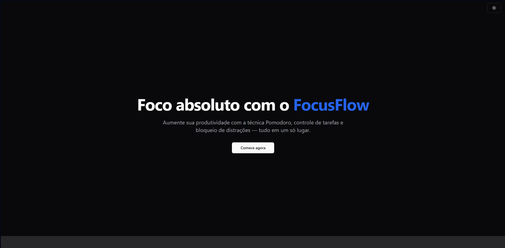

# 🧠 FocusFlow

Landing page moderna e responsiva para um produto fictício de produtividade chamado **FocusFlow**, um app baseado na técnica Pomodoro com foco e bloqueio de distrações.



🔗 **Acesse o projeto online**:  
👉 [https://appfocusflow.vercel.app](https://appfocusflow.vercel.app)

---

## ✨ Features

- Interface limpa e moderna
- Totalmente responsivo (mobile-first)
- Animações com Framer Motion
- Componentes acessíveis com ShadCN UI
- Dark mode automático
- Código organizado com boas práticas

---

## 🚀 Tecnologias utilizadas

- [Next.js 14 (App Router)](https://nextjs.org/)
- [TypeScript](https://www.typescriptlang.org/)
- [TailwindCSS](https://tailwindcss.com/)
- [Framer Motion](https://www.framer.com/motion/)
- [ShadCN UI](https://ui.shadcn.dev/)
- [Vercel](https://vercel.com/) para deploy

---

## 📦 Como rodar localmente

```bash
# Clone o repositório
git clone https://github.com/Rwaik-Dev/focusflow.git
cd focusflow

# Instale as dependências
npm install

# Rode o servidor local
npm run dev
